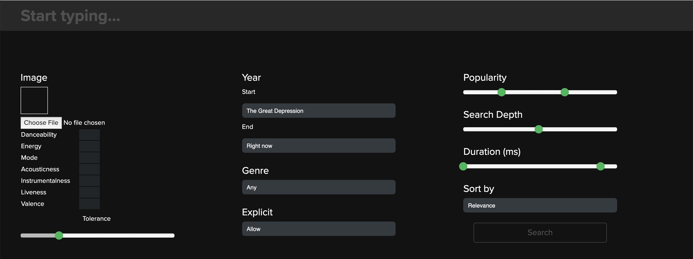

#  findio
The Spotify search you don't need and never wanted.

## Table of contents

- [Overview](#overview)
    - [Search interface](#search-interface)
    - [Search results](#search-interface)
    - [Usage tips](#usage-tips)
- [Setup](#setup)
    - [Training](#training)
- [License](#license)


## Overview

**findio** is a web app built on Node.js and Python with TypeScript, Express, HTML/CSS/JS, Bootstrap, and TensorFlow (+TensorFlow.js).

It provides an overly complicated, yet very powerful search interface for the Spotify catalog via the Spotify Web API. Use it to find new songs in a different way or analyze your favorite songs to understand how they are related.

### Search interface



**findio** provides an overengineered search interface for the Spotify catalog with the ability to search across a number of different attributes, filters, and sorting methods, many of which are not currently made available as part of the Spotify API.

- Audio feature similarity (by image or manual)
- Release year range
- Genre
- Explicit content
- Popularity
- Search depth
- Track duration
- 29 different sorting options

The following sections will walk through how to use these features.

#### Image to audio feature neural network

We trained a [convolutional neural network ](https://en.wikipedia.org/wiki/Convolutional_neural_network) using a dataset of album covers and the associated Spotify audio features for each train in order to learn a mapping from the pixel space to the audio feature space. This means that you can upload any image from your computer and the model will predict the audio features for a track that had that image as its album cover. You can then specify a tolerance value which is used to filter out search results that are far away from the given audio features. Optionally, you can directly specify the the audio features without uploading an image. 


The CNN was trained in Python using Keras. After training we save out the model architecture and weights and use TensorFlow.js running on the front-end to load the trained model. When you upload an image it is processed on the front-end to be 64x64 (crudely) and then run through the model. Therefore, note that we do not access or save any files you upload, they all remain completely on the client (we also use your CPU to run the model saving our server valuable flops). 

#### Release range

You can select a range of years to search across. Only tracks released within that range will be shown. To make your music search extra nostalgic all of the years are listed by an even that occur that year. Make sure to select a start year early than the end year or else you will not get any results. To make things easy it defaults to searching all songs released between the Great Depression and Right now. 


#### Genre

Spotify provides a list of hundreds of genres that can be used during a search. We allow you to specify one of these genres during the search, or specify 'Any'. 
Note that many of these genres seem to be somewhat bogus, and not all will return search results. 


#### Explicit

A simple control to specify what you want to do with explicit content. You can allow explicit content (default), exclude it, or only allow explicit content.


#### Popularity

Popularity is one of the key features of a track. This slides allows you to specify a range of acceptable popularity values. This will allow you to find only the most popular tracks if you can't be bothered with any of that underground indie junk or filter out the masses are listening to.


#### Search depth

If you want more results, go deeper. This control allows you to specify how deep into the annals of Spotify to search for that golden track. You can search up to 1000 tracks deep. Note that this will increase the search time, so please be patient. If you are having issues finding any tracks for your search increase the search depth so see if that helps. 


#### Duration


### Search results

### Usage tips

## Setup

You will need [Node.js](https://nodejs.org/en/) installed on your platform (v12).

**1. Get the code**
```
git clone https://github.com/csteinmetz1/findio
```

**2. Install modules**
```
npm install
```

**3. Setup [Spotify Web API keys](https://developer.spotify.com/dashboard)**

You will need a Spotify account and then create an application to get the keys.
Once you have the keys create a new file `.env`, with the following structure:

```
CLIENT_ID=YOUR_CLIENT_ID
CLIENT_SECRET=YOUR_CLIENT_SECRET
CALLBACK_URI=http://localhost:8000/callback
PORT=8000
NODE_ENV=development
```

**5. Build and run**

This will do a bunch of things, download the trained models weights, 
compile TypeScript to JavaScript, copy static assets to the build directory, 
and start the app running in development mode at http://localhost:8000 

```
npm run prod
```

### Training

If you want to train the model with your own data follow these steps.
To create your own dataset you will need images of size 64x64 as well as a vector of the 7 audio features for each image.

Navigate to the `train` directory
```
cd train
```

Install Python dependencies
```
pip install -r requirements.txt
```

Create hdf5 archive with covers and audio features
```
python package.py
```

Run the training script
```
python train.py
```

## License
The MIT License
Copyright (c) 2019 [Christian Steinmetz](https://www.christiansteinmetz.com/) & [Sean Myers](https://seanmyers.xyz/)